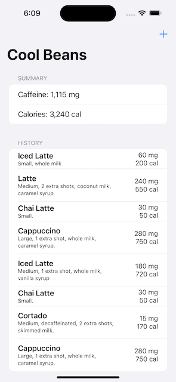
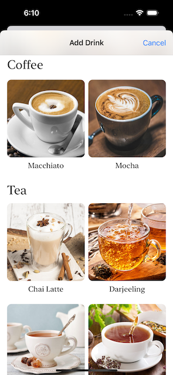
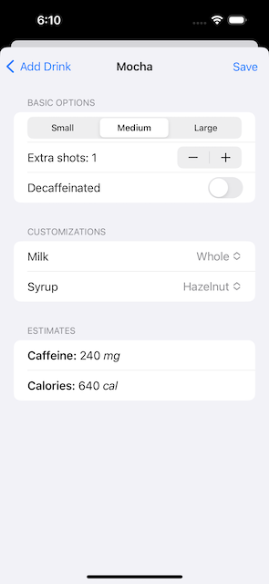

# Cool Beans
App for ordering drinks from a fictional coffee shop, built with the latest features of SwiftUI.

### Featuring
- NavigationStack flow
- JSON encoding/decoding
- Swipe actions
- Live search

### Screenshots

